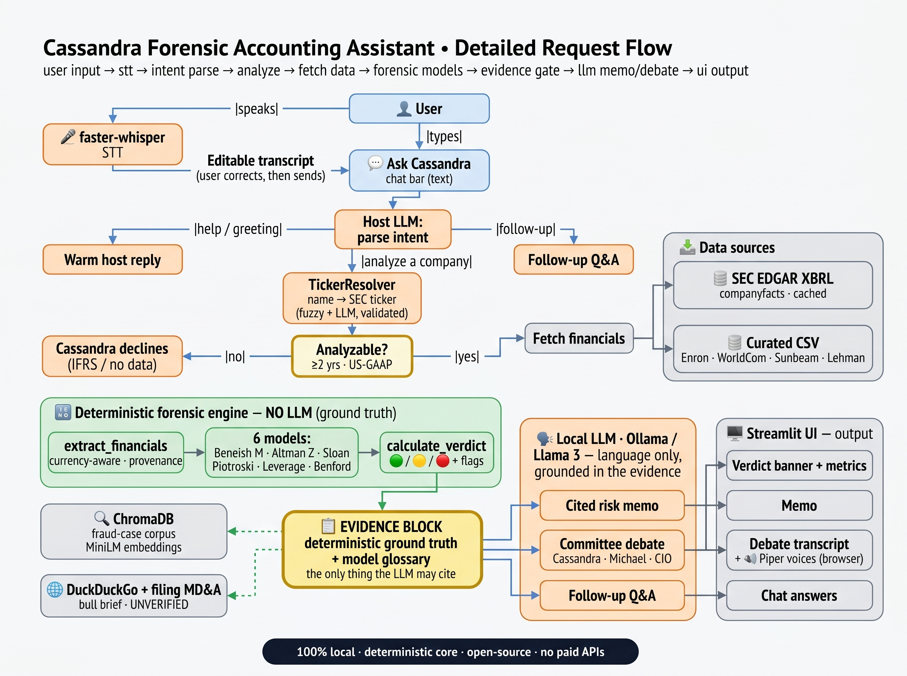

# 🔍 CASSANDRA — An AI Forensic Accountant

**Detecting financial-statement fraud & distress from public SEC filings — deterministic red-flag models, explained and debated by a local LLM you talk to.**

[](https://github.com/franzbeli/cassandra-ai/actions/workflows/ci.yml)

> **Educational analysis, not investment advice.** Every score is computed deterministically from
> SEC filings — **the LLM never invents a number, a formula, or a ticker**; it only explains, cites,
> debates, and contextualizes.

*CAP 942 — Capstone Project: AI Application Development. Local-first Streamlit app powered by an
open-source LLM (Ollama / Llama 3).*



*How a request flows: **user input → name resolution → deterministic scoring → an evidence gate →
grounded LLM language → output.** Editable source + full walkthrough in
[workflow_diagram.md](workflow_diagram.md) (`docs/workflow.mmd`).*

---

## 1. The problem

Major accounting frauds and corporate failures — **Enron, WorldCom, Sunbeam, Lehman Brothers** — were
detectable in companies' own public financial statements *years* before they collapsed. Forensic
accountants catch these with a well-established toolkit of quantitative red-flag models, but applying
it is slow, manual, and locked inside specialist expertise. Most investors, analysts, and students
never run it.

**CASSANDRA turns that toolkit into a conversational AI application.** You talk to a host persona —
type or *speak* a company by name (no ticker needed) — and it resolves the company against the SEC's
list, pulls its structured financials, computes the standard forensic models **in deterministic
code**, aggregates a single 🟢 Clean / 🟡 Watch / 🔴 High Risk verdict, and then a local LLM writes a
cited **Forensic Risk Memo**, runs an investment-committee **debate**, and answers your follow-up
questions — all grounded in the deterministic results.

## 2. Why it matters

- **Real, high-value problem.** Undetected accounting fraud destroys billions in investor capital;
  surfacing red flags early has obvious value to any analyst, auditor, or investor.
- **The *right* use of an LLM.** A hard line between **deterministic quantitative analysis** (code)
  and **language generation** (LLM) — the pattern that separates serious AI applications from "ask
  the chatbot to guess." The LLM only ever sees an *evidence block* built by code, so it can explain
  and argue but cannot fabricate a figure.
- **A defensible, measurable demo.** Run it on **Sunbeam**, where the *same company* flips 🔴 on its
  as-reported books and 🟢 on its restated books; watch the flags fire on known frauds and stay calm
  on blue-chips — backed by a real **precision/recall evaluation (1.00 on a 13-case labeled set)**,
  not anecdote.
- **Genuinely interactive.** A committee of personas debates the stock — and you can *listen* to
  them, each in a distinct voice — before a CIO persona rules. It's forensic-accounting
  infrastructure, not another summarizer or chatbot.

## 3. The forensic models (computed in code, not by the LLM)

| Model | What it catches | Flag |
|---|---|---|
| **Beneish M-Score** | Earnings manipulation (8-ratio model) | `M > −2.22` |
| **Altman Z-Score** | Financial distress / bankruptcy | `Z < 1.81` distress, `1.81–2.99` grey |
| **Sloan Accruals Ratio** | Low earnings quality `(NI − OCF) / avg assets` | `> 0.10` |
| **Piotroski F-Score** | Fundamental strength (0–9) — counterweight | `≤ 2` weak |
| **Leverage / Equity Multiplier** | Over-leverage & insolvency (covers M/Z blind spots) | `> 20×`, negative equity |
| **Benford's Law** | Leading-digit anomalies `P(d)=log₁₀(1+1/d)` (advisory) | `MAD > 0.015` |

The models are complementary by design — no single one catches everything (WorldCom's
expense-capitalization fraud evades Beneish but trips the Z-Score; Lehman's over-leverage evades both
but the leverage flag catches it). A confidence-aware **`calculate_verdict`** aggregates them: a
single high-confidence fraud/distress signal → 🔴; an earnings-quality or advisory signal alone → 🟡;
a low-confidence version of a strong flag is downgraded a tier. Blue-chips stay 🟢.

## 4. Features (all implemented)

**Conversational front door**
- 💬 **"Ask Cassandra"** — one chat surface for everything. Type or 🎤 speak a company *by name*; a
  host LLM parses intent (analyze / follow-up / help).
- 🔗 **Name → validated ticker** — fuzzy match (`rapidfuzz`) plus the LLM's guess, both validated
  against the official SEC company list, so the ticker is always ground-truth (Google → Alphabet/GOOGL).
- 🛂 **Analyzability pre-flight + proportionate tone** — checks for ≥2 annual years of US-GAAP data
  and frames its reply to the actual result (reassuring for clean, serious only when warranted —
  never "fraud" for a healthy company). Gracefully declines IFRS-only / data-poor filers.

**Deterministic engine & data**
- 🧮 Six forensic models + a confidence-aware aggregated verdict (flags, mitigants, confidence).
- 🏦 Live **SEC EDGAR XBRL** fetch with rate-limit throttling, ticker-map caching, retry/backoff.
- 🌐 **Currency-aware** — analyzes foreign US-GAAP filers in their native currency (e.g. **Sony in
  JPY**); the scores are ratios, so the verdict is currency-independent (no FX conversion needed).
- 🧩 Robust XBRL resolution — `form/fp/fy/frame` annual selection, 20-F/40-F support, a derivation
  layer (`SG&A = G&A + Selling&Marketing`), per-figure **provenance**, a **coverage** metric, and
  **point-in-time** (`as_of_date`) resolution for bias-free backtests.
- 📂 Curated dataset for pre-XBRL classics (Sunbeam cooked + restated, Enron, WorldCom, Lehman).

**The LLM committee (grounded in an evidence block + model glossary)**
- 📝 Cited **Forensic Risk Memo**, streamed token-by-token.
- 🎭 **Committee debate** — Cassandra (forensic skeptic) vs. Michael (bull) ruled by a CIO who
  respects the deterministic verdict. **Scaling conviction both ways:** Michael concedes outright on
  clear fraud (no spin); Cassandra stands down on a clean company (no manufactured bear case).
- 🐂 **Asymmetric bull research** — for the debate only, Michael gets forward-looking ammo from the
  latest filing's MD&A + curated **DuckDuckGo** news, explicitly labeled **UNVERIFIED** (it fuels the
  argument, never the scores).
- 💬 **Grounded Q&A** — concise-first answers with an offer to go deeper (and a built-in **model
  glossary** so "what is the M-Score?" gets the *correct* formula, never a hallucinated one); stays
  locked to the model you're asking about.
- 📚 RAG analogues from a historical fraud-case corpus (ChromaDB + SentenceTransformers).

**Voice & UX**
- 🎤 **Voice input** — mic in the input bar (`faster-whisper` STT); a recording lands in an
  **editable draft** you confirm before sending.
- 🔊 **Multi-voice debate narration** — each persona read in its own local **Piper** voice, played in
  order in the browser (works over a remote/Tailscale view).
- 💾 **Demo persistence** — completed debates are saved and **replayed** with a quick word-by-word
  reveal; audio is cached for instant playback.
- 🧹 Type **`clear`** to reset the conversation; dark-themed dashboard with verdict banner, metrics
  (coverage · flags · currency · source), hero tabs (Memo · Committee Debate), and a collapsible
  Quantitative-detail panel (gauges, the exact evidence block, provenance, raw output).
- 🔧 Dev tooling: a tag-discovery helper, an evaluation harness, a pytest suite (offline + opt-in
  live), and CI.

## 5. Architecture — how it works

```
User (chat/voice) → intent parse → name→ticker resolve → fetch financials (SEC XBRL | curated CSV)
  → Deterministic forensic engine: extract → 6 models → verdict   [no LLM — ground truth]
    → Evidence block (+ model glossary, + optional RAG analogues)  [the only thing the LLM may cite]
      → Local LLM (Ollama / Llama 3): memo · committee debate · Q&A
        → Streamlit: verdict banner · memo · debate (+ Piper voices) · chat
```

The **evidence block is the gate**: figures and the verdict are produced by auditable Python; the LLM
is handed only that block, so it explains and debates but can't invent numbers. See the diagram above
and [workflow_diagram.md](workflow_diagram.md) for the full walkthrough.

## 6. Evaluation

`python evaluate.py` scores the deterministic verdict against a labeled set — real, sourced
frauds/distress (Enron, WorldCom, Sunbeam, Lehman) as positives, and the restated-Sunbeam control
plus live SEC blue-chips (MSFT, AAPL, GOOGL, AMZN, JNJ, KO, WMT, NVDA) as negatives. Prediction = a
🔴 **High Risk** verdict (🟡/🟢 count as not flagged).

| Metric | Score |
|---|---|
| Precision | 1.00 |
| Recall | 1.00 |
| Specificity | 1.00 |
| Accuracy | 1.00 (n = 13) |

All four frauds are flagged 🔴, no clean company is (NVIDIA correctly lands 🟡 *Watch* on a marginal
accruals signal, not a false 🔴). This is a small, curated, point-in-time set — it demonstrates the
**calibration**, not a population-level estimate. `python evaluate.py --offline` runs the curated
subset without network; `tests/test_evaluation.py` guards it in CI.

## 7. Tech stack

| Layer | Tool |
|---|---|
| LLM & orchestration | Ollama (single resident Llama 3 8B) + LangChain — Cassandra / Michael / CIO are system-prompt swaps on the *same* model |
| Data source | SEC EDGAR XBRL `companyfacts` + `company_tickers.json` |
| Forensic engine | Python · pandas · numpy (deterministic) |
| Name resolution | rapidfuzz (difflib fallback) |
| Vector DB / embeddings | ChromaDB + SentenceTransformers (`all-MiniLM-L6-v2`) |
| Bull research | `ddgs` (DuckDuckGo) + filing MD&A |
| Voice | faster-whisper (STT) + Piper (TTS; optional Edge online fallback) |
| Frontend | Streamlit + Plotly |

**No paid APIs. No model training. Runs entirely on a local machine (CPU inference) — the only
network calls are the free SEC EDGAR API and DuckDuckGo (debate research only).**

## 8. Project structure

```
app.py             # Streamlit UI + orchestration (entrypoint)
sec_client.py      # SEC EDGAR ticker→CIK + companyfacts fetch, cache, throttle, retry
ticker_resolver.py # Company name → validated SEC ticker (fuzzy + LLM guess)
forensics.py       # Deterministic engine: 6 models, currency-aware resolver, derivations, verdict
curated_cases.py   # Loader for pre-XBRL / non-EDGAR cases -> engine-compatible dicts
rag.py             # ChromaDB fraud-case corpus (build + query)
llm.py             # Ollama/Llama 3: host, memo, debate, Q&A (grounded in the evidence block)
research.py        # Bull brief: filing MD&A + DuckDuckGo news (UNVERIFIED, debate only)
voice.py           # faster-whisper STT + multi-voice Piper TTS narration
demo_store.py      # Save/replay completed debates    narration_cache.py  # Cached debate audio clips
evaluate.py        # Precision/recall of the verdict vs a labeled set
tag_discovery.py   # Dev helper: surfaces unmapped XBRL tags to extend the tag map
data/
  fraud_cases.csv  # Curated, sourced fraud/control cases (tracked)
  sec_cache/ chroma/ demo_cache/ audio_cache/   # local caches / vector store (gitignored)
voices/            # Piper .onnx voice models (gitignored)
docs/              # workflow.mmd source · workflow.jpeg (chart) · workflow_diagram.md
tests/             # pytest suite (offline) + opt-in live blue-chip checks
.github/workflows/ # CI: flake8 + pytest
```

## 9. Getting started

**Prerequisites:** Python 3.10+ and [Ollama](https://ollama.com/download).

```powershell
# 1. Set up the environment (creates .venv, installs deps, seeds .env)
.\setup.ps1                      # Windows PowerShell

# 2. Pull the local model
ollama pull llama3

# 3. Set your SEC User-Agent (required by SEC EDGAR) in .env:
#    SEC_USER_AGENT=Your Name your.email@example.com

# 4. Launch
.\.venv\Scripts\streamlit run app.py
```

Open the URL Streamlit prints (default `http://localhost:8501`).

**Optional — voice & narration:** install `requirements-voice.txt`, then drop three Piper `.onnx`
voices (+ their `.onnx.json`) in `voices/` and point `PIPER_VOICE_CASSANDRA/_MICHAEL/_CIO` in `.env`
at them — the debate's **▶ Play debate aloud** button appears automatically. The mic appears whenever
`faster-whisper` is installed.

> **Access from another device:** Streamlit prints a `Network URL` for same-Wi-Fi access. For
> off-network use, a private VPN such as **Tailscale** is recommended — the app has no auth, so avoid
> public tunnels.

## 10. Usage

- **Talk to it:** *"analyze Apple"*, *"is Nvidia cooking the books?"*, *"what is the Altman Z-Score?"*,
  or just *"what can you do?"* — by text or mic. Type **`clear`** to reset.
- **Curated demo cases** (no network): `SUNBEAM` (🔴) vs `SUNBEAM_RESTATED` (🟢) for a cooked-vs-corrected
  contrast on the same company, or `ENRON` / `WORLDCOM` / `LEHMAN`.
- **Live tickers:** `MSFT`, `AAPL`, `GOOGL`, `NVDA`, `AMZN`, … fetched live from SEC XBRL.
- Generate the **memo**, run the **committee debate** (optionally narrated), and **interrogate** the
  numbers — all in the chat. CPU inference takes ~1–3 min for longer generations.

Modules are also runnable for quick checks: `python forensics.py`, `python curated_cases.py`,
`python evaluate.py`, `python tag_discovery.py GOOGL`.

## 11. Testing

```bash
pytest -q                 # offline suite (math + calibration + eval), fast, no network
pytest --run-live         # also runs live SEC blue-chip "stays calm" checks
flake8 --select=E9,F .    # lint (syntax errors + undefined names)
```

CI runs `flake8` + `pytest` on every push/PR via GitHub Actions.

## 12. Data sources & limitations

- **SEC EDGAR XBRL** (`companyfacts`) — free, official, structured financials for US/ADR filers, used
  with a descriptive `User-Agent` within rate limits. XBRL only goes back to ~2009.
- **Curated CSV** (`data/fraud_cases.csv`) for pre-XBRL classics XBRL can't serve — each row
  transcribed from a cited primary source (10-K / SEC AAER / Beneish case study); a blank cell is
  *missing* data (never fabricated), reflected in the coverage metric.
- **Honest limits:** XBRL tag inconsistency across filers/years (mitigated by the tag-mapping +
  derivation layer, surfaced via coverage); the classic Altman/Beneish models are weaker for
  financial institutions (e.g. Sony's financial arm depresses its Z-Score) — flagged as a known
  blind spot. *Luckin Coffee and Wirecard were evaluated and dropped:* Luckin's fraud year was never
  filed as an audited annual report, and Wirecard is a foreign IFRS filer whose **fabricated cash**
  makes a company look *healthier* — a documented blind spot of these models (as is pre-revenue
  Nikola). These limits are reported, not papered over.

## Disclaimer

CASSANDRA is an **educational** tool for surfacing quantitative red flags from public filings. It is
**not investment advice**, not an audit, and not a determination of fraud. Forensic models produce
false positives and false negatives; always consult primary filings and qualified professionals.
