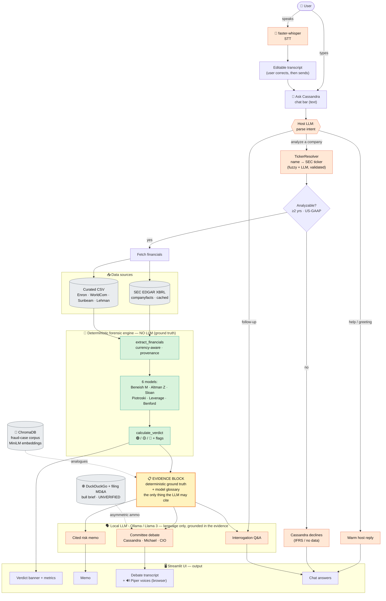

# CASSANDRA — Technical Workflow Diagram

How a request flows through the system: **user input → resolution → deterministic scoring → grounded
LLM language → output.** The single most important property is the **EVIDENCE BLOCK gate** (yellow):
all numbers and the verdict are produced by deterministic code; the LLM only ever sees — and may only
cite — that block, so it can explain and debate but **never invents a number, formula, or ticker.**

> Renders on GitHub as-is. To export an image for slides/Word: paste `docs/workflow.mmd` into
> https://mermaid.live (Actions → PNG/SVG), or open it in VS Code with a Mermaid extension and export.
> A pre-rendered copy lives at `docs/workflow.png` when available.

**Legend** — 🟩 green = deterministic code (numbers/verdict) · 🟧 orange = LLM (language only) ·
⬜ grey = data sources / external · 🟨 yellow = the evidence gate the LLM cannot cross.

---

## Walkthrough (maps to the required deliverable points)

**1. User input flow.** The user talks to the **host persona** in one chat bar — typed, or spoken via
the **mic** (`faster-whisper` STT → an *editable transcript* they confirm before sending). A host LLM
call parses the message into an intent: **analyze a company / follow-up question / help**.

**2. Resolution (never trust a free-text ticker).** For "analyze", `TickerResolver` maps the company
*name* to a real SEC ticker (fuzzy match + the LLM's guess, both validated against the official SEC
company list). An `analyzable` pre-flight checks for ≥2 annual years of US-GAAP data; if not (e.g. an
IFRS-only filer), Cassandra declines gracefully.

**3. Data sources.** Financials come from **live SEC EDGAR XBRL** (`companyfacts`, throttled + locally
cached) or, for pre-XBRL classics, a **curated CSV** (Enron, WorldCom, Sunbeam ± restated, Lehman).

**4. Deterministic scoring (the core — no LLM).** `extract_financials` (currency-aware, with
provenance/coverage) feeds **six models** — Beneish M-Score, Altman Z, Sloan accruals, Piotroski F,
Leverage, Benford — and `calculate_verdict` aggregates them into a **🟢/🟡/🔴 verdict + flags**. This
is plain, auditable Python; identical inputs always give identical scores.

**5. The evidence gate + retrieval (vector DB).** The verdict and figures are rendered into an
**evidence block** (plus a fixed *model glossary* of correct formulas). Optionally, **ChromaDB** RAG
(SentenceTransformers `all-MiniLM-L6-v2` over a fraud-case corpus) adds historical analogues. This
block is the **only** thing the LLM is allowed to cite.

**6. LLM interaction (language only).** A single resident **Ollama / Llama 3** model, grounded in the
evidence block, produces: a **cited memo**, a 3-persona **committee debate** (Cassandra the skeptic,
Michael the bull, a CIO who respects the verdict), and **interrogation Q&A**. For the debate only,
`research.py` adds an *asymmetric* bull brief (DuckDuckGo news + the latest filing's MD&A), explicitly
labeled **UNVERIFIED** — it fuels the argument but never the scores.

**7. Output handling (UI + API).** Everything renders in **Streamlit**: a verdict banner + metric row,
the memo, the debate transcript (optionally **read aloud** in three Piper voices played in the
browser), and chat answers. External API touchpoints are the free **SEC EDGAR** API and **DuckDuckGo**
search; the LLM, vector DB, and TTS are all **local**.

## Tools & frameworks shown
UI **Streamlit** · LLM **Ollama / Llama 3** via **LangChain** · vector DB **ChromaDB** +
**Sentence-Transformers** · data **SEC EDGAR XBRL** (`requests`) + curated CSV (**pandas/numpy**) ·
resolver **rapidfuzz** · research **ddgs** · voice **faster-whisper** (STT) + **Piper** (TTS).
